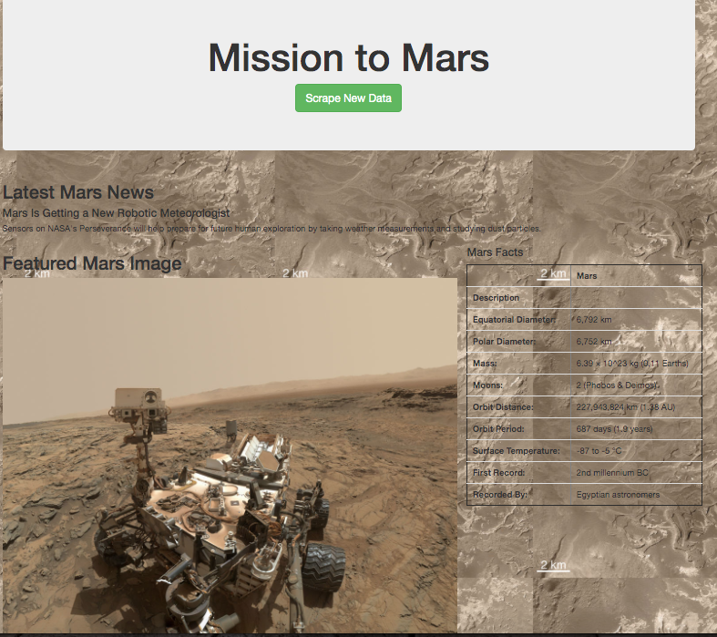
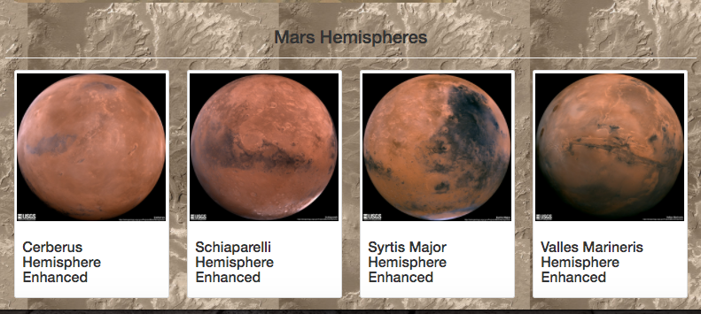

# Mission-to-Mars

## Analysis Overview

The purpose of this project was to scrape full-resolution images of Mars's hemispheres from websites along with their associated titles, store the data in a Mongo database, and finally to use flask, a web applicaiton, to display the scraped data.  The web application was then altered within an html template to enhance the mobile-responsiveness and general accomodation of these images with Bootstrap 3.

---------------------------------------------
## Resources:

Data Sources: 

https://astrogeology.usgs.gov/search/results?q=hemisphere+enhanced&k1=target&v1=Mars
https://mars.nasa.gov/news/'
https://www.jpl.nasa.gov/spaceimages/?search=&category=Mars'
http://space-facts.com/mars

Software: 

Visual Studio Code 1.49.2, Python 3.8.3, BeautifulSoup 4.9.1,
Flask 1.1.2, Flask-PyMongo 2.3.0, Jupyter 1.0.0, Splinter 0.14.0,
Bootstrap 3.3.7

---------------------------------------------

## Results

As a result of the project, the web application served as a useful display tool for the scraped webpages, including the four hemisphere pictures of Mars.  Upon clicking the "Scrape New Data" button, the site is able to utilize flask to initiate a live scrape by referencing a "scraping.py" file which contained functions pertinent to collecting data from each page.  This also allowed the storage of the collected data into a Mongo database which would then be fed into the flask application routes.  As such, the index page was able to display the newly scraped images and tables as seen in the following images.

## Summary

From this project, it is clear that with the incorporation of a few tools such as flask, html, bootstrap, and a python-based file for scraping functions one can easily create a web application for collecting and displaying data.  Furthermore, the data and the display is extremely customizable according to the individual goals and preferences of the user.